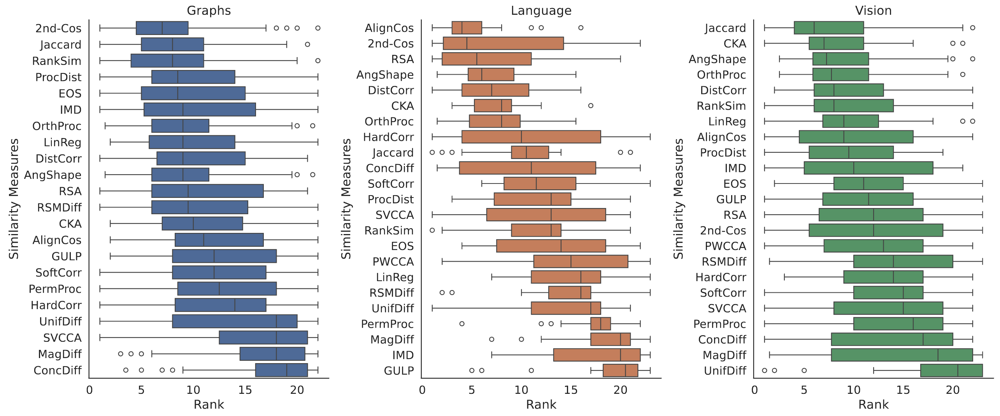

# `ReSi`: A Comprehensive Benchmark for Representational Similarity Measures
The `ReSi` Benchmark provides a unified framework to quantitatively compare a wide array of representational similiarty measures. It comprises 23 similarity measures, comes with 11 different architectures and spans the Vision, Language and Graph domain.

In the following we explain:
1. How to setup the Benchmark
2. How to use the Benchmark (e.g. how to reproduce results from the Paper)
3. How extend the Benchmark with additional measures.



## 1. Setting Up the Repository

### 1.1 Install Repository and Requirements
```shell
# Download the repository
git clone git@github.com:mklabunde/resi.git
cd resi

# Create a virtual environment with Python 3.10
# With Conda ...
conda create -n ENVNAME python=3.10
conda active ENVNAME
# ... or venv
python -m venv .venv
source .venv/bin/activate

# Afterwards install the requirements and repository
pip install -r requirements.txt
pip install -e .
```

### 1.2 Set Up Experiment Path (Optional)

The `"REP_SIM"` environment variable defines the `EXPERIMENT_PATH` in which all results and models are saved.
If this is not specified, the `experiments/` subdirectory will be used as `EXPERIMENT_PATH` by default.

### 1.3 Downloading Datasets

If you want to rerun our experiments from scratch, or test a measure that you have implemented, it is required that the necessary models and datasets have been downloaded.
Most datasets will be automatically downloaded from `huggingface` ([SST2](https://huggingface.co/datasets/stanfordnlp/sst2), [MNLI](https://huggingface.co/datasets/nyu-mll/glue)), `pytorch geometric` ([Cora](https://pytorch-geometric.readthedocs.io/en/stable/generated/torch_geometric.datasets.Planetoid.html), [flickr](https://pytorch-geometric.readthedocs.io/en/stable/generated/torch_geometric.datasets.Flickr.html#torch_geometric.datasets.Flickr)) or `ogb` ([ogbn-arxiv](https://ogb.stanford.edu/docs/nodeprop/#ogbn-arxiv)) once the first attempt to use them is made.
All datasets are saved in `EXPERIMENT_PATH/datasets/{nlp,graphs,vision}`, depending on the domain.

For vision, you need to manually download the ImageNet100 dataset from [kaggle](https://www.kaggle.com/datasets/ambityga/imagenet100/data?select=Labels.json) due to license restrictions.
After downloading, move `train.X1-4` into one joint `train` folder and rename the `val.X` into a `val` folder so they each contain 100 class folders.
This dataset then should be named `Imagenet100` and located in the directory specified by the `VISION_DATA_PATH` (should be `<EXPERIMENT_PATH>/datasets/vision` -- see `repsim/benchmark/paths.py` for details).

### 1.4 Downloading Models

To get all relevant models, you need to download the model files from Zenodo and unpack the zipped files into corresponding subdirectories of `EXPERIMENT_PATH/models`:
* Language and graphs: https://doi.org/10.5281/zenodo.11565486. Move the content of `models/nlp` and `eval_results.json` inside `nlp_data.zip` into `EXPERIMENT_PATH/models/nlp`. Move the models inside `graph_data.zip` into `EXPERIMENT_PATH/models/graphs`.
* Vision: Run the script `python vision/download_vision_model.py` to auto-download and extract all the models. Alternatively one can manually download the files from Zenodo ([Part 1](https://zenodo.org/records/11544180)/[Part 2](https://zenodo.org/records/11548523)), extract them, and move them into a directory named `<VISION_MODEL_PATH>/vision_models_simbench/.` (check `paths.py` from earlier for `VISION_DATA_PATH` details).

### 1.5 Downloading Result Files (Optional)

The results from all our experiments are stored in a `results.parquet` file, which you can download from [Zenodo](https://doi.org/10.5281/zenodo.11565486).
You need this file if you want to easily test a new similarity measure and compare it to the existing results.
Download the file and place it in the `EXPERIMENT_PATH/results/` directory.

## 2. Running the Benchmark

The main way to (re)run experiments from the benchmark is to set up a `config.yaml` file, and then simply run
```bash
    python3 -m repsim.run -c path/to/config.yaml
```
In the `configs/` subdirectory, you can find all the config files necessary to reproduce our experiments.

**Example**: As a quick example, we also provide a demo config that runs the augmentation affinity test on Cora, using GCN, GraphSAGE, and GAT models, and applying all benchmark measures except *PWCCA*, which often times fails to converge, and *RSM norm difference* and *IMD score*, which take relatively long to compute. This test should finish within a few minutes.

```bash
    python3 -m repsim.run -c configs/demo_augmentation_test_cora.yaml
```

### 2.1 Config Files

If you want only want to run experiments on specific tests or domains, you need to modify an existing config or create a new one.
[This example config](configs/example_config.yaml) documents the different parts of it.

### 2.2 About Parallelization and Overwriting of Result Files

If you want to run multiple experiments in parallel, it is crucial that these **NEVER** write/work on the same results parquet file at the same time, as specified by `raw_results_filename` in the configs.
Otherwise, the file can be corrupted making the file unreadable.
It is, however, no issue to write on an already existing parquet file with a single process - this will simply append the new results.

Regarding the CSVs of (aggregated) results, which are specied in configs under `table_creation` -> `filename` and `full_df_filename`, it is crucial to consider that existing files will be overwritten.
**NOTE:** The given config files in the `configs` directory were designed such that no such overwriting can occur, and thus these can safely be run in parallel.

### 2.3 Running Tests in Graph Domain without Specifying Configs

For the graph domain, another option to (re)run individual tests for all the graph models (GCN, GraphSAGE, GAT) on a given dataset is to run

```bash
    python3 -m repsim.run_graphs -t {test_name} -d {dataset} [-m {measures}]
```
Implicitly, this scripts creates a config file as described above, which is then used to run a test. The config files stored in the configs directory were also generated from this script.
Valid dataset names are `cora`, `flickr`, and `ogbn-arxiv`, valid test names are `label_test`, `shortcut_test`, `augmentation_test`, `layer_test`, and `output_correlation_test`, where the latter runs Tests 1 and 2 from our benchmark simultaneously.
The argument for measures is optional, and by default, all measures that are registered under `ALL_MEASURES` in the `repsim.measures` module will be used.
In this case, results will be saved into files called `graphs_{test_name}_{dataset}.parquet`, `graphs_{test_name}_{dataset}.csv` (`filename`), and `graphs_{test_name}_{dataset}_full.csv` (`full_df_filename`).
When specific measures that should be used are specified, the corresponding measure names will be appended to the result file names to avoid problems with files overwriting each other (cf. Section 2.3 above).
The name of the generated config file will follow the same pattern.


### 2.4 Merging Result Files

To merge all the parquet files you have produced into a single file, you can use [this script](repsim/merge.py).


### 2.5  Plotting Results
To plot the results, the csv files with full results are used (`full_df_filename` in the config).
The results from the paper are available in `experiments/paper_results`.
[This notebook](tables_and_plots.ipynb) can be used to create the overview table as well as the plots of the rank distribution in the paper.


## 3. Adding a New Measure

If you want to use our benchmark on a measure that has not been implemented yet, you can easily add your measure to the benchmark with the following steps:

#### 1. Create a new file:
Add a python script `your_measure.py` to the `repsim.measures` module, in which your similarity measure will be implemented.

#### 2. Implement the similarity function:
In your script, you need to implement a your similariy measure in a function of the following signature
```python
def your_measure(
    R: Union[torch.Tensor, npt.NDArray],
    Rp: Union[torch.Tensor, npt.NDArray],
    shape: SHAPE_TYPE,
) -> float:
```
where the shape parameter of type `SHAPE_TYPE = Literal["nd", "ntd", "nchw"]` defines input format of the given representations: `"nd"` represents input matrices in the $n \times d$ format, `"ntd"` corresponds to $n \times ntokens \times d$, and `"nchw"` corresponds to $n \times nchannels \times height \times width$. Your measure should be able to process shapes of all these types. If higher-dimension inputs should simply be flattened to the `"nd"` format, you can use the `flatten` function that we provide in `repsim.measures.utils`. We further provide additional functions for preprocessing/normalizing inputs in this module.

You can skip this step if you implement the function inside the `__call__` method, as described in the next step.

#### 3. Wrap your function into a class that inherits from `RepresentationalSimilarityMeasure`:

The class specifies several properties of the similarity measure, such that its values can be correctly interpreted in the benchmark framework.
Particularly important are `larger_is_more_similar` and `is_symmetric`.
If you are unsure about the other properties, specify them as `False`.
The `RepresentationalSimilarityMeasure` class can be imported from `repsim.benchmark.utils`.
To wrap your function into such a class, you can use the following template:
```python
class YourMeasure(RepresentationalSimilarityMeasure):
    def __init__(self):
        super().__init__(
            sim_func=your_measure,
            larger_is_more_similar=False             # Fill in True iff for your measure, higher values indicate more similarity
            is_metric=True,                          # Fill in True iff your measure satisfies the properties of a distance metric.
            is_symmetric=True,                       # Fill in True iff your measure is symmetric, i.e., m(R, Rp) = m(Rp,R)
            invariant_to_affine=True,                # Fill in True iff your measure is invariant to affine transformations
            invariant_to_invertible_linear=True,     # Fill in True iff your measure is invariant to invertible linear transformations
            invariant_to_ortho=True,                 # Fill in True iff your measure is invariant to orthogonal transformations
            invariant_to_permutation=True,           # Fill in True iff your measure is invariant to permutations
            invariant_to_isotropic_scaling=True,     # Fill in True iff your measure is invariant to isotropic scaling
            invariant_to_translation=True,           # Fill in True iff your measure is invariant to translations
        )

    def __call__(self, R: torch.Tensor | npt.NDArray, Rp: torch.Tensor | npt.NDArray, shape: SHAPE_TYPE) -> float:

        # here you can, in priciple, conduct some preprocessing already, such as aligning spatial dimensions for vision inputs

        return self.sim_func(R, Rp, shape)
```

#### 4. Register your measure in the module

Open `repsim/benchmark/__init__.py`, import `YourMeasure` class, and append it to the `CLASSES` list that is defined in this script - this will also automatically append it to `ALL_MEASURES`, which is the list of measures considered in our benchmark. Thus, your measure is now registered in our benchmark, and can, for instance, be explicitly included in the `config.yaml` files via its class name.

## License

Our code is available under CC-BY 4.0.
